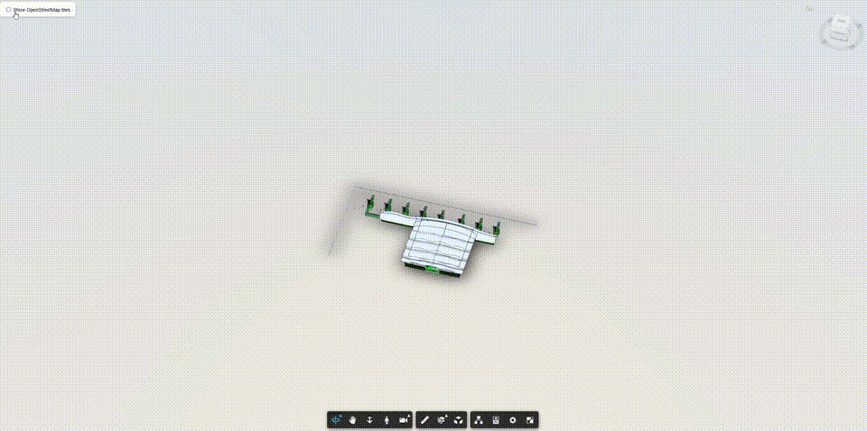

# bim-tile-overlay

Overlay web map tiles (OSM, aerial imagery, custom XYZ) onto an **Autodesk APS Viewer** as a camera-synced 3D ground plane.

[](https://infraplan.hr)

**By [Infra Plan](https://infraplan.hr)**



## The Problem

Placing geographic map tiles under a BIM model in Autodesk Viewer requires:

1. Extracting the camera frustum and projecting it onto a ground plane
2. Converting between the viewer's internal coordinate system and WGS84
3. Figuring out which map tiles cover the visible area at the right zoom level
4. Fetching, stitching, and caching those tiles into a GPU-friendly texture
5. Positioning a THREE.js plane in 3D space aligned with the geographic bounds
6. Updating everything in real-time as the camera moves

This library handles all of that in ~500 lines of code.

## Quick Start

```bash
npm install bim-tile-overlay proj4
```

```javascript
import { TileOverlay, CoordinateTransformer } from 'bim-tile-overlay';

// After viewer has loaded a model:
const transformer = CoordinateTransformer.fromAPSViewer(
    viewer,
    // proj4 definition for your local CRS (this example uses Croatia HTRS96/TM)
    '+proj=tmerc +lat_0=0 +lon_0=16.5 +k=0.9999 +x_0=500000 +y_0=0 +ellps=GRS80 +towgs84=0,0,0,0,0,0,0 +units=m +no_defs'
);

const overlay = new TileOverlay(viewer, transformer, {
    urlTemplate: 'https://tile.openstreetmap.org/{z}/{x}/{y}.png',
    zoomRange: [14, 19],
    maxBounds: transformer.getModelBoundsLL84(),
});

await overlay.enable();
```

## How It Works

```
Camera frustum corners
  → Ray-cast to ground plane (Z elevation)
  → Convert hit points to WGS84 lon/lat
  → Determine visible geographic bounds
  → Calculate optimal tile zoom level
  → Fetch XYZ tiles in parallel (reusing cached tiles)
  → Stitch into single canvas texture
  → Map onto THREE.js plane in viewer space
  → Update on camera change (debounced)
```

**Coordinate pipeline:**
```
WGS84 (lon, lat)
  ↔ Local CRS (meters) → via proj4
  ↔ CRS in feet → × 3.28084
  ↔ BIM internal coords → via refPointTransform rotation + translation
  ↔ Viewer display coords → minus globalOffset
```

## API Reference

### `TileOverlay`

Main class. Creates a map tile overlay on the viewer.

```javascript
const overlay = new TileOverlay(viewer, transformer, options);
```

**Options:**

| Option | Type | Default | Description |
|--------|------|---------|-------------|
| `urlTemplate` | `string` | *required* | Tile URL with `{z}`, `{x}`, `{y}` placeholders |
| `zoomRange` | `[number, number]` | *required* | Min and max zoom levels |
| `maxBounds` | `GeoBounds` | *required* | Geographic bounds to clip tile fetching |
| `groundZ` | `number` | `modelBBox.min.z - 5` | Z elevation of the ground plane |
| `debounceMs` | `number` | `150` | Camera change debounce delay (ms) |
| `maxCachedTiles` | `number` | `512` | Max individual tiles kept in memory; cached tiles are drawn immediately when they come back into view |
| `zoomScaleFactor` | `number` | `12` | Tile detail vs. camera distance. Higher = more detail |
| `progressInterval` | `number` | `5` | Texture refresh frequency during tile loading (every N tiles). Always fires on the last tile. Set to 1 for per-tile updates. |
| `onTileError` | `function` | `console.warn` | Called with `{ url, x, y, zoom }` when a tile fails to load |
| `sceneName` | `string` | `'bim-tile-overlay'` | Viewer overlay scene name |
| `maxCacheSize` | `number` | — | *Deprecated, ignored.* Use `maxCachedTiles` |

**Methods:**

| Method | Description |
|--------|-------------|
| `enable()` | Show the overlay and start tracking camera |
| `disable()` | Hide the overlay and cancel pending tile downloads; the tile cache is kept for re-enabling |
| `destroy()` | Fully dispose all GPU resources and cache |
| `update()` | Force an immediate tile refresh |

### `CoordinateTransformer`

Converts between WGS84 and the viewer's coordinate system.

```javascript
// From viewer (recommended):
const transformer = CoordinateTransformer.fromAPSViewer(viewer, crsDefinition);

// Manual config:
const transformer = new CoordinateTransformer({
    crs: '+proj=tmerc +lat_0=0 +lon_0=16.5 ...',
    refPointTransform: [...],  // From model metadata
    globalOffset: { x, y, z },
    modelBBox: { min: { x, y, z }, max: { x, y, z } },
});
```

**Methods:**

| Method | Description |
|--------|-------------|
| `lonLatToViewer(lon, lat, z?)` | WGS84 → viewer coordinates |
| `viewerToLonLat(x, y, z?)` | Viewer coordinates → WGS84 |
| `getModelBoundsLL84()` | Model bounding box in WGS84 |

### Utility Functions

```javascript
import { lonLatToTile, tileToLonLat, getViewportBounds, createTileCache } from 'bim-tile-overlay';
```

| Function | Description |
|----------|-------------|
| `lonLatToTile(lon, lat, zoom)` | WGS84 → tile {x, y} coordinates |
| `tileToLonLat(x, y, zoom)` | Tile coordinates → WGS84 (NW corner) |
| `getViewportBounds(camera, transformer, options)` | Camera frustum → geographic bounds + zoom |
| `createTileCache(maxSize?)` | LRU cache; frees an entry's `canvas` memory on eviction |

## Finding Your CRS

Your BIM model needs a local Coordinate Reference System (CRS) for accurate positioning. Common ones:

| Region | CRS | Code |
|--------|-----|------|
| Croatia | HTRS96/TM | EPSG:3765 |
| UK | British National Grid | EPSG:27700 |
| Germany | ETRS89/UTM zone 32N | EPSG:25832 |
| US (New York) | NAD83/NY Long Island | EPSG:2263 |

Find your CRS definition at [epsg.io](https://epsg.io/) and pass the proj4 string.

## Requirements

- **Autodesk Viewer** (APS / Forge) with a loaded, georeferenced model — the Viewer script provides `THREE.js` and `Autodesk` globals that this library uses internally; you do not need to install them separately
- **proj4** (peer dependency) — `npm install proj4`
- The BIM model must have `refPointTransform` in its metadata (set via Revit's survey/project point)

## Contributing

Contributions are welcome! Please open an issue or pull request.

## License

MIT - [Infra Plan](https://infraplan.hr)
